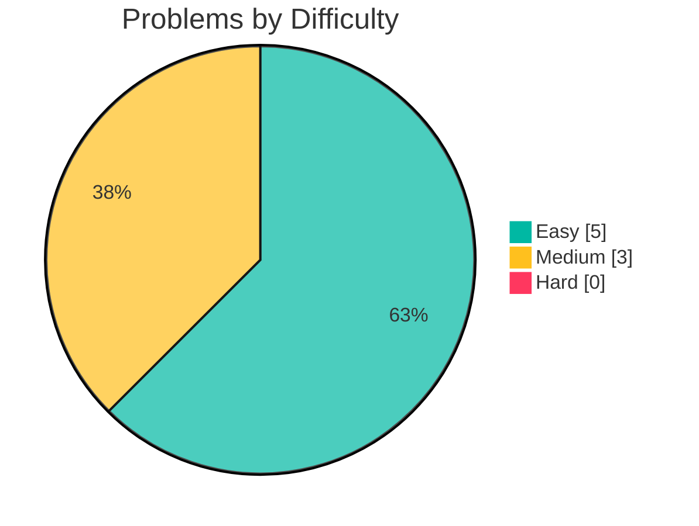
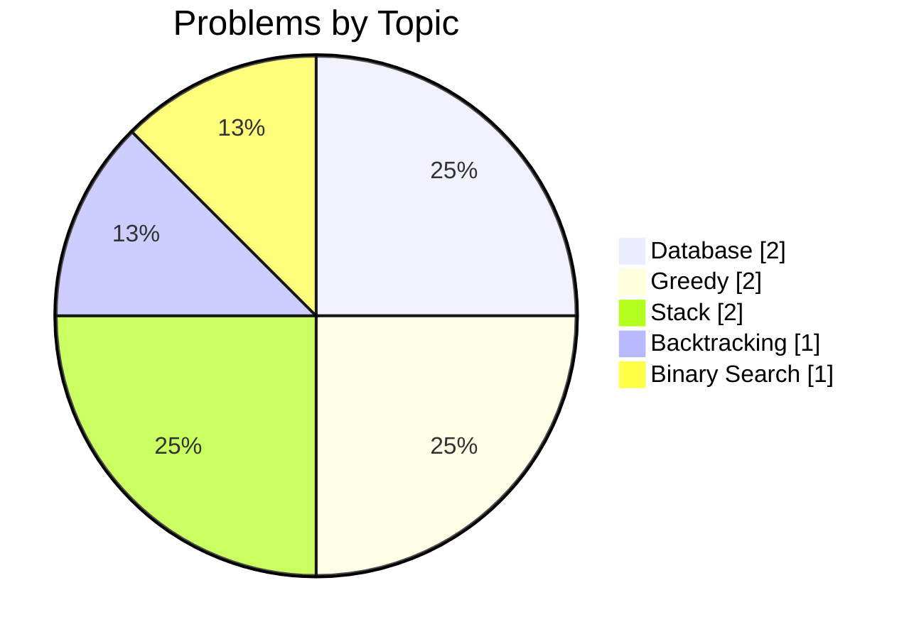

<!-- leetstash:stats:start -->
# 🧩 LeetStash — Progress

_Last updated: 2026-10-09 00:15_

   

## Difficulty breakdown

## By language

| Language | Count | |
|---|---|---|
| Java | 6 | `████████████████████` |
| mysql | 2 | `███████░░░░░░░░░░░░░` |

## By topic

| Topic | Count | |
|---|---|---|
| Database | 2 | `████████████████████` |
| Greedy | 2 | `████████████████████` |
| Stack | 2 | `████████████████████` |
| Backtracking | 1 | `██████████░░░░░░░░░░` |
| Binary Search | 1 | `██████████░░░░░░░░░░` |

## Table of contents

| # | Problem | Difficulty | Topic | Language |
|---|---|---|---|---|
| 35 | [Search Insert Position](https://github.com/samy-D5/Leetcode/blob/main/Java/Binary%20Search/0035-search-insert-position.md) | Easy | Binary Search | Java |
| 90 | [Subsets II](https://github.com/samy-D5/Leetcode/blob/main/Java/Backtracking/0090-subsets-ii.md) | Medium | Backtracking | Java |
| 197 | [Rising Temperature](https://github.com/samy-D5/Leetcode/blob/main/mysql/Database/0197-rising-temperature.md) | Easy | Database | mysql |
| 409 | [Longest Palindrome](https://github.com/samy-D5/Leetcode/blob/main/Java/Greedy/0409-longest-palindrome.md) | Easy | Greedy | Java |
| 856 | [Score of Parentheses](https://github.com/samy-D5/Leetcode/blob/main/Java/Stack/0856-score-of-parentheses.md) | Medium | Stack | Java |
| 1021 | [Remove Outermost Parentheses](https://github.com/samy-D5/Leetcode/blob/main/Java/Stack/1021-remove-outermost-parentheses.md) | Easy | Stack | Java |
| 1070 | [Product Sales Analysis III](https://github.com/samy-D5/Leetcode/blob/main/mysql/Database/1070-product-sales-analysis-iii.md) | Medium | Database | mysql |
| 1221 | [Split a String in Balanced Strings](https://github.com/samy-D5/Leetcode/blob/main/Java/Greedy/1221-split-a-string-in-balanced-strings.md) | Easy | Greedy | Java |
<!-- leetstash:stats:end -->
