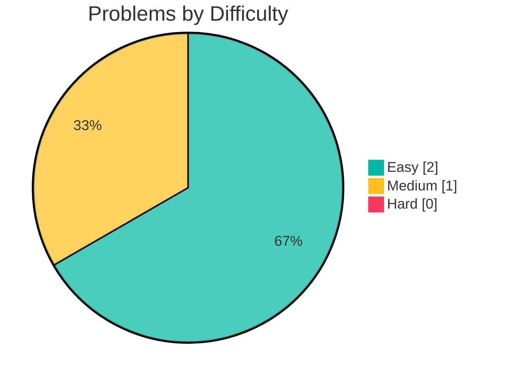
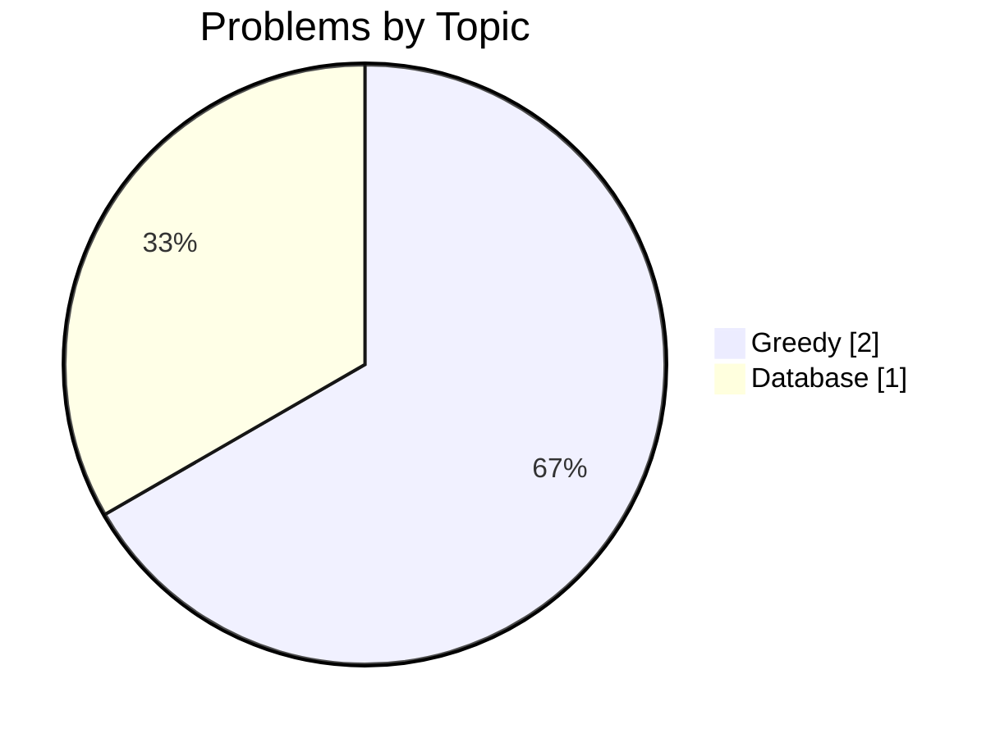

<!-- leetstash:stats:start -->
# 🧩 LeetStash — Progress

_Last updated: 2026-09-30 11:26_

   

## Difficulty breakdown

## By language

| Language | Count | |
|---|---|---|
| Java | 2 | `████████████████████` |
| mysql | 1 | `██████████░░░░░░░░░░` |

## By topic

| Topic | Count | |
|---|---|---|
| Greedy | 2 | `████████████████████` |
| Database | 1 | `██████████░░░░░░░░░░` |

## Table of contents

| # | Problem | Difficulty | Topic | Language |
|---|---|---|---|---|
| 409 | [Longest Palindrome](https://github.com/samy-D5/Leetcode/blob/main/Java/Greedy/0409-longest-palindrome.md) | Easy | Greedy | Java |
| 1070 | [Product Sales Analysis III](https://github.com/samy-D5/Leetcode/blob/main/mysql/Database/1070-product-sales-analysis-iii.md) | Medium | Database | mysql |
| 1221 | [Split a String in Balanced Strings](https://github.com/samy-D5/Leetcode/blob/main/Java/Greedy/1221-split-a-string-in-balanced-strings.md) | Easy | Greedy | Java |
<!-- leetstash:stats:end -->
