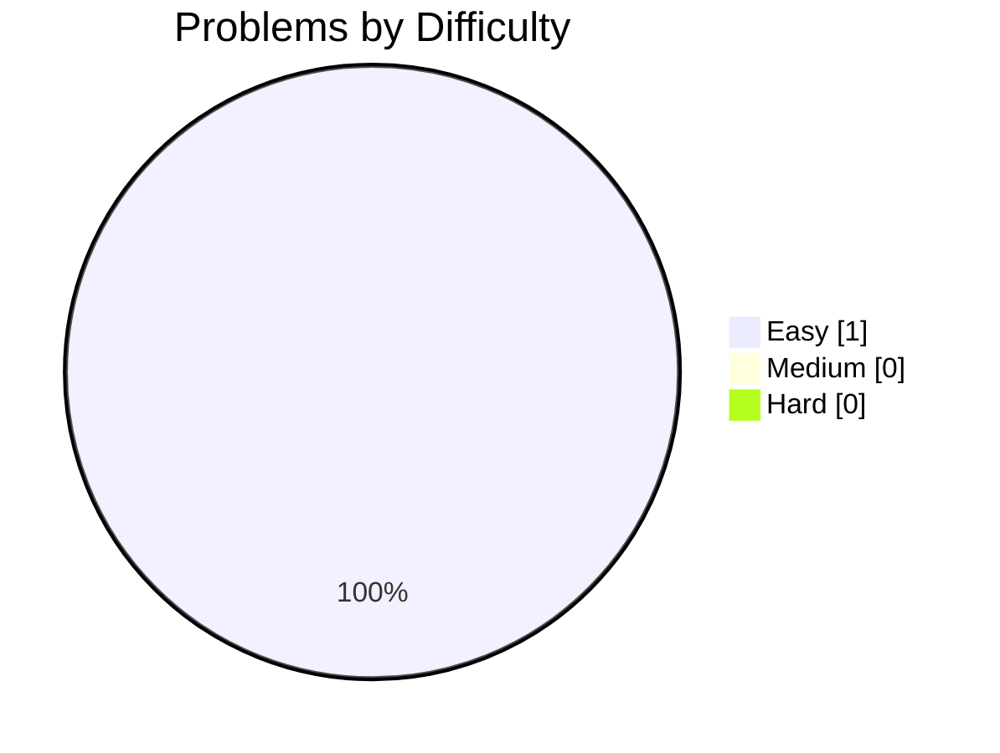
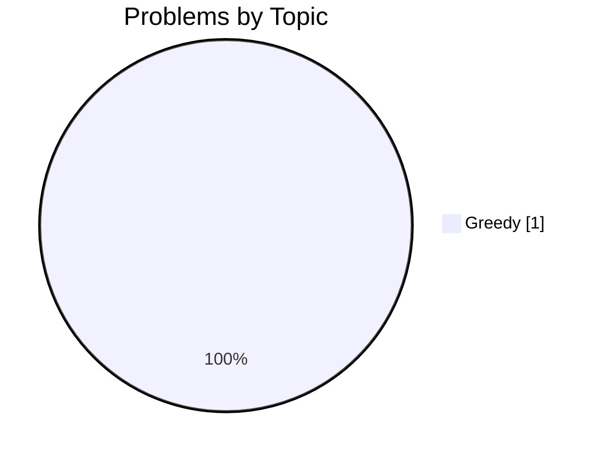

# 🧩 LeetStash — Progress

_Last updated: 2026-09-30 11:13_

   

## Difficulty breakdown

## By language

| Language | Count | |
|---|---|---|
| Java | 1 | `████████████████████` |

## By topic

| Topic | Count | |
|---|---|---|
| Greedy | 1 | `████████████████████` |

## Table of contents

| # | Problem | Difficulty | Topic | Language |
|---|---|---|---|---|
| 409 | [Longest Palindrome](https://github.com/samy-D5/Leetcode/blob/main/Java/Greedy/0409-longest-palindrome.md) | Easy | Greedy | Java |
